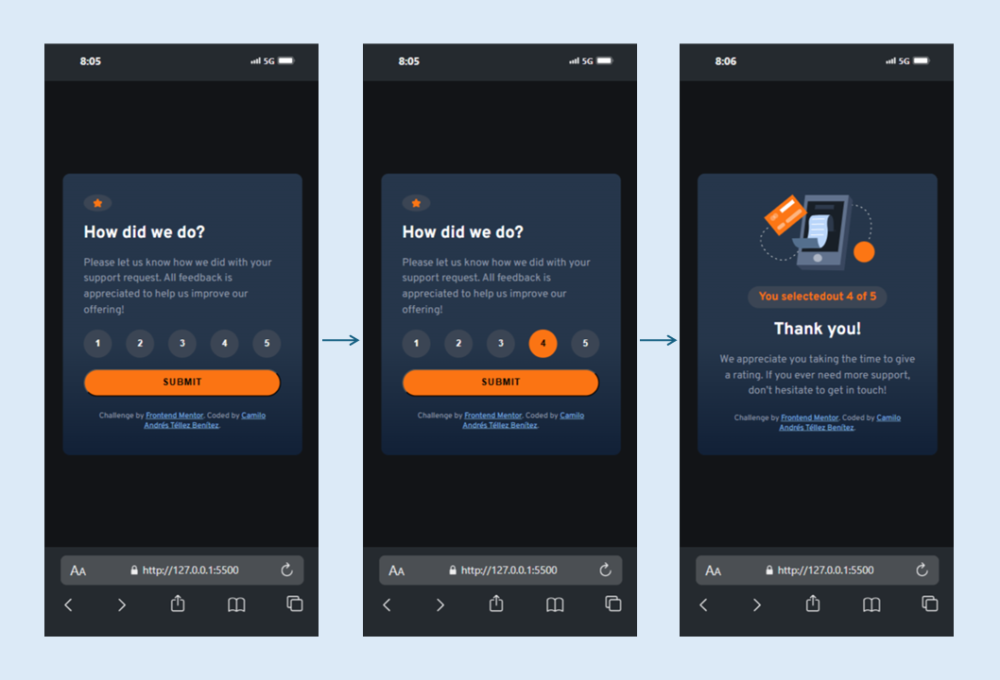

# Interactive rating component solution

Esta es mi solución para el reto [Interactive rating component challenge en Frontend Mentor](https://www.frontendmentor.io/challenges/interactive-rating-component-koxpeBUmI).

## 📁 Tabla de contenidos

- [Descripción general](#descripción-general)
  - [¿De qué trata el reto?](#de-qué-trata-el-reto)
  - [Captura de pantalla](#captura-de-pantalla)
  - [Enlace al proyecto](#enlace-al-proyecto)
- [Mi proceso](#mi-proceso)
  - [Tecnologías utilizadas](#tecnologías-utilizadas)
- [Sobre mí](#sobre-mí)

## 🌐 Descripción general

### ¿De qué trata el reto?

El objetivo de este reto es crear un componente interactivo de calificación. Los usuarios deben poder:

- Ver un diseño adaptable dependiendo del tamaño de pantalla.
- Visualizar los efectos hover en los elementos interactivos.
- Seleccionar una calificación numérica.
- Enviar la calificación y ver un mensaje de agradecimiento con la calificación seleccionada.

### 📸 Captura de pantalla

Así se ve el componente en un dispositivo movil:

### 🔗 Enlace al proyecto

- [Ver el sitio en línea](https://camilo-atb.github.io/Interactive-rating-component/)  

## 🚀 Mi proceso

### Tecnologías utilizadas

Para construir este componente, utilicé:

- **HTML5 semántico**, para asegurar una estructura clara y accesible.
- **CSS3**, aprovechando variables personalizadas para mantener consistencia en los estilos.
- **Flexbox**, para una disposición flexible y adaptable.
- Enfoque **mobile-first**, para priorizar la experiencia en dispositivos móviles.
- **JavaScript**, para gestionar la lógica e interactividad.

## 👨‍💻 Sobre mí

Si quieres conocer más sobre mi trabajo y mi proceso de aprendizaje, te invito a visitar mis perfiles:

- [LinkedIn](http://www.linkedin.com/in/camilo-téllez)
- [Frontend Mentor](https://www.frontendmentor.io/profile/camilo-atb)
- [YouTube](https://www.youtube.com/@camilotellez887)

¡Gracias por visitar este proyecto y por seguir mi proceso! 🚀
